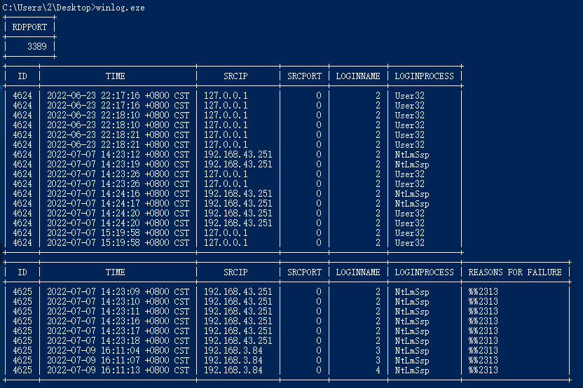
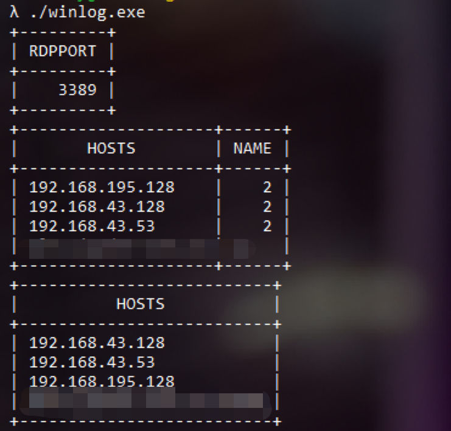

## 更新记录
- 2022-07-09：实现基本功能


## 工具说明
功能如下：
- 获取本地RDP端口：
```
\HKEY_LOCAL_MACHINE\SYSTEM\CurrentControlSet\Control\Terminal Server\WinStations\RDP-Tcp
```
- 获取当前用户mstsc远程连接记录，包括host、port、loginName
```
HKEY_CURRENT_USER\SOFTWARE\Microsoft\Terminal Server Client\Default
HKEY_CURRENT_USER\SOFTWARE\Microsoft\Terminal Server Client\Servers
```
- 获取当前服务器安全日志4624、4625事件
```
Advapi32.dll --> ReadEventLogW --> Security --> 4624、4625
```

## 使用说明
- 需要管理员去权限
- 只适配中文系统
- 只在win10、win11上测试过
- 使用时执行exe即可，如下：





## 参考
- https://github.com/Adminisme/SharpRDPLog
- https://github.com/mackerelio/go-check-plugins